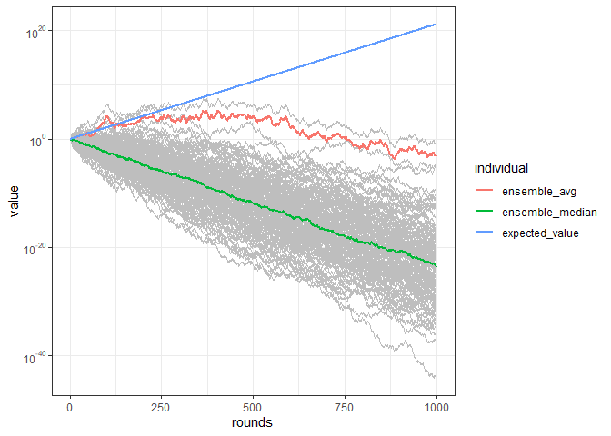

<!-- README.md is generated from README.Rmd. Please edit that file -->

# Ergodicity Economics

## Replicating Example Gamble

First objective was to replicate Fig. 2 of this
[paper](https://rdcu.be/cS2t3). For non-technical may be hard to
understand what is happening without modeling.

Emanuel Derman’s
[tweet](https://twitter.com/EmanuelDerman/status/1532473709239455745)
stresses out that *“a 200% - 50% equal-probability gamble has an
expected payoff of 125% if played once, but if you keep playing the
eventual return is 50% x 200% = 100% in long run, no gain.”*

Next step is to implement a Shiny application in order let the user play
with inputs, and show that increasing the number of players increases
the probability that the ensemble averages would match the expected
value.

## Code Optimization

In order to try to optimise the code for a larger tibble, I have
momentarily divided the code in 3 different phases:

1.  Tibble Generation

2.  Transformation

3.  Plotting

The code below is taking the same input given in the paper.

### Tibble Generation

The bottleneck here is replicate, which is nesting sapply, that is
nesting lapply. So with a large number of players a lot of vectors are
created through lapply.

``` r
assign("EV", ((0.6 * 0.5) + (1.5 * 0.5)), envir = .GlobalEnv)
df <- as_tibble(replicate(150,
                          cumprod(sample(
                            c(0.6, 1.5),
                            size = 1000,
                            replace = TRUE
                          ))))
```

### Transformation

The bottleneck is on making the tibble longer in order to let ggplot
properly work.

``` r
df <-   pivot_longer(
    mutate(
      rowid_to_column(df, "rounds"),
      ensemble_avg = rowMeans(df),
      ensemble_median = apply(df, 1, median),
      expected_value = EV ^ rounds
    ),
    cols = !1,
    names_to = "individual"
  )
```

### Plotting

Plotting is the biggest bottleneck, but should be addressed directly
while developing the shiny app.

``` r
focus <- c("ensemble_avg", "expected_value", "ensemble_median")

ggplot() +
  geom_line(
    subset(df, !individual %in% focus),
    mapping = aes(x = rounds, y = value, group = individual),
    color = "grey",
    size = 0.5,
    alpha = 0.2
  ) +
  geom_line(
    subset(df, individual %in% focus),
    mapping = aes(x = rounds, y = value, color = individual),
    size = 1
  ) +
  scale_y_log10(
    breaks = trans_breaks("log10", function(x)
      10 ^ x),
    labels = trans_format("log10", math_format(10 ^ .x))
  ) +
  labs(color = "") +
  theme_bw() +
  theme(legend.position = "bottom")
```

<!-- -->
