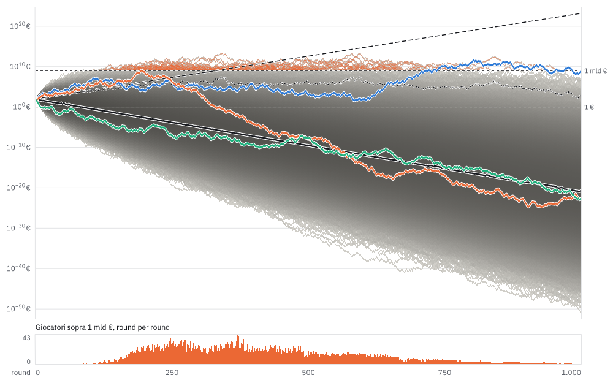

# Ergodicity Economics: the coin game

Each round, every player tosses a coin. Heads: the wealth of the player increases by 50%. Tails: it
decreases by 40%. All players start with 100 €. The expected value increases by 5% each round, but the
typical player loses almost everything. This is the example of Fig. 2 in Ole Peters,
[*The ergodicity problem in economics*](https://rdcu.be/cS2t3) (Nature Physics, 2019). Emanuel Derman
states the same point in [a tweet](https://twitter.com/EmanuelDerman/status/1532473709239455745).

This project simulates the full path of every player and shows all of them in one chart. The code is
Rust only: simulation, text, chart pixels and the build of the web page.



*1,000,000 players, 1,000 rounds, seed 2022. 277 players reach 1 billion € at least once. At most 43 of
them are above 1 billion € in the same round. 243 of the 277 end below 1 €.*

## How to read the chart

| Mark | Meaning |
|---|---|
| Grey background | Number of players in each cell (round × wealth level). A cell that stands out more from the background holds more players. The scale is logarithmic; the page shows it with numbers. If more than one round or level falls on one pixel, the pixel shows the fullest cell. No cell is drawn on the other side of a threshold line. |
| Thin orange lines | The players who have at least 1 billion € in that round. You can count them round by round. An option on the page shows their full paths. |
| Thick coloured lines | Three real players of the run: the richest at the end; among the players who reached 1 billion €, the one who ended lowest; the first player below 1 €. Each role is decided over all players. |
| Solid / dotted / dashed line | Median player / mean of all players / expected value. |

## Design

- **Every path is reproducible.** The coin of player `i` at round `t` is one bit of Philox4x32-10
  (counter `(i / 64, t)`, key = seed). Philox is counter-based: any path is a function of `(seed, i)` only.
  The result is the same on every device and with any number of threads.
- **Exact numbers.** For each player the simulation stores integers only: heads at the end, round and heads
  of the peak, first round below 1 €. One function (`Lattice::at`) converts `(round, heads)` to wealth. A test
  checks every lattice point up to 2,000 rounds: none is closer than 1e-9 (log10) to a threshold, so each
  threshold test in `f64` is exact.
- **Values are truncated, not rounded.** A shown value is never above the true value. A player below
  1 billion € never shows as "1,00 mld €".

## Layout

| Path | Contents |
|---|---|
| `crates/coin-core` | Philox4x32-10, simulation, per-player summaries, density, ensemble lines, headline figures, Italian number format |
| `crates/coin-chart` | Chart renderer (tiny-skia, IBM Plex Sans outlines), palette, density rasterisation |
| `crates/coin-web` | WebAssembly entry points, page text (JSON), tooltip |
| `web/index.html` | Page template: markup, CSS, and the JavaScript that moves bytes between workers, WebAssembly and the screen |
| `xtask` | `web`, `png` and `bench` commands |

## Commands

Requirements: Rust 1.80 or later, and the WebAssembly target:

```sh
rustup target add wasm32-unknown-unknown
```

| Command | Result |
|---|---|
| `cargo test --workspace --release` | All tests |
| `cargo xtask web` | `dist/index.html` (standalone page) and `dist/fragment.html` (the same page without the document skeleton) |
| `cargo xtask png --players 1000000 --seed 2022 --theme dark --out chart.png` | The chart as PNG, rendered natively |
| `cargo xtask bench` | Native simulation speed |

To open the page, serve `dist/` with any static server, for example `python3 -m http.server -d dist`.

## Verification

The tests check:

1. Philox4x32-10 against the Random123 known-answer vectors.
2. The simulation against an independent pure-Python implementation that compares wealth as exact fractions
   (`crates/coin-core/tests/golden.txt`).
3. The fast simulation, the density, the ensemble lines and the headline figures against brute-force
   recomputation from re-created paths.
4. Same results with 1 to 7 threads; adding players does not change the first ones.
5. Density against Binomial(t, 1/2) (chi-square, 3 seeds, 5 rounds); no correlation between neighbour rounds
   or neighbour players.
6. Rasterisation: each pixel matches its definition; every occupied cell is visible at every tested size;
   isolated cells are not enlarged; no cell paints on the wrong side of a threshold.
7. Every player role name is true for 80 runs; singular and plural texts; JSON escaping.

## Speed

Measured in this project's development container (4 cores), 1,000 rounds:

| Players | Native, 4 threads | Browser (Chromium, WebAssembly, 4 workers) |
|---|---|---|
| 10,000 | 0.03 s | 0.05 s simulation, 0.05 s chart |
| 100,000 | 0.13 s | 0.29 s simulation, 0.05 s chart |
| 1,000,000 | 0.92 s | 2.4 s simulation, 0.12 s chart |

## License

Apache License 2.0 (`LICENSE.md`). IBM Plex Sans: SIL Open Font License 1.1
(`crates/coin-chart/assets/IBMPlexSans-LICENSE.txt`).
